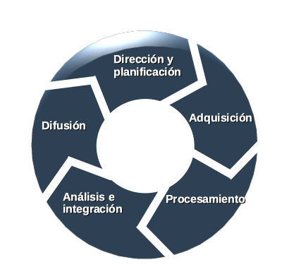

# **OSINT**

## Open Source INTelligence

### II Jornadas de Ciberseguridad  

#### IES Virgen del Carmen

Enero 2025 (v2)

---

# ¿Qué es eso de OSINT?

Llamamos OSINT al conocimiento recopilado a partir de fuentes de acceso público, ojo público no quiere decir gratuito, también es posible *"comprar"* esa información de manera **lícita**. El proceso incluye la búsqueda, selección y adquisición de la información, así como un posterior procesado y análisis de la misma con el fin de obtener conocimiento útil y aplicable en distintos ámbitos.

¿Mande? ¿Me lo explicas con otras palabras...? :satisfied:

--- 

# OSINT 

OSINT se refiere a la recopilación, análisis y uso de información de fuentes públicas y accesibles a todos. 

En otras palabras, OSINT se trata de obtener información útil y valiosa de fuentes de información que están disponibles para cualquiera, como redes sociales, sitios web, noticias, blogs y otros recursos en línea.

---

### OSINT

La información recopilada a través de OSINT se utiliza comúnmente para investigaciones, seguridad, inteligencia empresarial, análisis de mercado, entre otros fines. 

OSINT es una herramienta muy útil para la recopilación de información en la era digital, ya que hay una gran cantidad de información disponible en línea y se pueden utilizar técnicas de búsqueda y análisis para extraer información relevante.

---

# Inteligencias en el ámbito militar y de servicios de información 

1. HUMINT: Inteligencia recogida a partir de una persona en un espacio en cuestión.
2. GEOINT: Inteligencia geoespacial.
3. IMINT: Inteligencia a partir de imágenes.
4. MASINT: Inteligencia de medidas de señales, como pueden ser: nucleares, electromagnéticas, ópticas, de radar, radiofrecuencia, materiales (a partir de estudios químicos, análisis nucleares...).
5. SIGINT: Inteligencia obtenida a partir de la interceptación de señales.
6. TECHINT: Inteligencia obtenida a partir del estudio de la tecnología de países o empresas externas.
7. CYBINT/DNINT: Inteligencia cibernética o digital.
8. FININT: Inteligencia financiera.

---

### Fuentes abiertas como por ejemplo:

* Medios de comunicación: revistas, periódicos, radio, etc.
* Información pública de fuentes gubernamentales.
* Foros, redes sociales, blogs, wikis, etc.
* Conferencias, simposios, «papers», bibliotecas online, etc.

---

### Utilidad del OSINT:

* Conocer la reputación online de un usuario o empresa.
* Realizar estudios sociológicos, psicológicos, lingüísticos, etc.
* Auditoria de empresas y diferentes organismos con el fin de evaluar el nivel de privacidad y seguridad.
* Evaluar tendencias de mercados.
* Identificación y prevención de posibles amenazas en el ámbito militar o de la seguridad nacional.
* Como aspecto negativo, es utilizado por cibercriminales para lanzar ataques APT y «Spear Phishing».

---

### Fases investigación: 

---

### Fases investigación: 

1. **Dirección y planificación**: es la fase en la que se establecen todos los requerimientos que se deben cumplir, es decir, aquellas condiciones que deben satisfacerse para conseguir el objetivo o resolver el problema que ha originado el desarrollo del sistema OSINT.
2. **Adquisición**: consiste en especificar, a partir de los requisitos establecidos, las fuentes de interés que serán recopiladas. Hay que tener presente que el volumen de información disponible en Internet es prácticamente inabordable por lo que se deben identificar y concretar las fuentes de información relevante con el fin de optimizar el proceso de adquisición.
3. **Procesamiento**: etapa en la que se obtiene la información a partir de los orígenes indicados y se da formato a toda la información recopilada de manera que posteriormente pueda ser analizada.

---

### Fases investigación: 

4. **Análisis e integración**: es la fase en la que se genera inteligencia a partir de los datos recopilados y procesados. El objetivo es relacionar la información de distintos orígenes buscando patrones que permitan llegar a alguna conclusión significativa.
5. **Difusión y feedback**: consiste en presentar la información obtenida de una manera eficaz, potencialmente útil y comprensible, de manera que pueda ser correctamente explotada.

---

### Problemas principales en OSINT

* **Demasiada información**: como ya se ha puesto de manifiesto, la cantidad de información pública disponible en Internet es más que notable. Es por ello, que se debe realizar un proceso muy exhaustivo a la hora de identificar y seleccionar las fuentes de información de interés que van a ser recopiladas, y que posteriormente servirán para la generación de inteligencia. El hecho de utilizar un catálogo extenso de fuentes conlleva obviamente un mayor gasto a la hora de implementar el sistema, y en el caso de no tener disponibles los recursos necesarios, provoca una significativa ralentización del mismo.
* **Fiabilidad de las fuentes**: es importante valorar previamente las fuentes que van a nutrir el sistema de información ya que una selección errónea de las mismas puede provocar resultados erróneos y desinformación.

---

### Pero antes de comenzar a investigar

Como investigador OSINT, es importante que tomes medidas para proteger tu privacidad y seguridad en línea, especialmente si estás recopilando información sensible o investigando temas delicados. 

Siempre debes proteger tu identidad y siempre debemos evitar infringir la ley en tus actividades de investigación.

---

### Recomendaciones

* **Máquinas virtuales**: Una de las mejores prácticas es trabajar en una máquina virtual, ya que te permite crear un ambiente aislado del sistema operativo principal de tu ordenador. De esta manera, puedes instalar software específico para OSINT sin correr el riesgo de infectar tu sistema principal con malware o virus.
* **VPN**: Una VPN (Red Privada Virtual) es una herramienta que te permite navegar de forma anónima y segura en internet. Es especialmente útil si estás investigando desde una ubicación pública, como una biblioteca o una cafetería, ya que encripta tus datos y oculta tu dirección IP.
* **Cuentas ficticias**: Si estás investigando en redes sociales, es recomendable que utilices cuentas ficticias para evitar que tus actividades sean rastreadas hasta tu cuenta personal. Sin embargo, es importante que sigas los términos de servicio de la red social y no infrinjas la ley.

---

### Recomendaciones

* **Gestor de contraseñas**: Cuando creas muchas cuentas es importante recordar las contraseñas, es recomendable usar un gestor no online para ello.
* **Herramientas de OSINT**: Hay muchas herramientas disponibles para OSINT, como motores de búsqueda especializados, herramientas de análisis de redes sociales y de búsqueda de información. Es recomendable que investigues y pruebes diferentes herramientas para encontrar las que mejor se adapten a tus necesidades.

---

### El trabajo del investigador OSINT

#### Recopilación de datos

Aunque hoy día existen plataformas o sistemas como [Maltego](https://www.maltego.com) o [Leonardo](https://www.leonardocompany.com/) que combinan herramientas de Big Data e Inteligencia Artificial para ayudar a comprender y seguir el rastro de la información de nuestras investigaciones, normalmente el investigador OSINT usa diferentes herramientas Web combinadas con otros script (normalmente en Python) de elaboración propia o específicos para el tipo de investigación.

Por tanto, no sólo se trata de conocer una vasta variedad de herramientas sino también de automatizar tareas y saber programar.

---

### Herramientas para analizar Metadatos

* FOCA
* Exiftool
* file

---

### Herramientas para Instagram

* [Instaloader](https://instaloader.github.io/): Permite automaizar descargas de fotos/vídeo.
* [Instalooter](https://github.com/althonos/InstaLooter): Permite filtrar por fechas u otros parámetros las descargas.
* [Toutatis](https://github.com/megadose/toutatis): Permite extraer información de cuentas como teléfonos, emails y más.
* [Osintgram](https://github.com/Datalux/Osintgram): Quizás la más avanzada, permite datos de geolocalización, publicaciones antiguas, listas de seguidores, entre otros.

---

### Herramientas de usuario / correo electrónico

Existen multitud de herramientas como:

1. [Sherlock](https://github.com/sherlock-project/sherlock): Busca un *username* en diferentes redes sociales.
2. [Holene](https://github.com/megadose/holehe): Busca si se usa un email en diferentes redes sociales.
3. [SocialScan](https://github.com/iojw/socialscan): Busca si un *username* y/o *email* está en redes sociales.
4. [WhatsMyName](https://github.com/WebBreacher/WhatsMyName): Hace enumeración de sitios Webs donde aparece un determinado *username*.
5. [Email2Phone](https://github.com/martinvigo/email2phonenumber): Le damos un número de teléfono y nos devuelve el nombre de la persona a quien pertenece.

---

### Herramientas para analizar redes (CLI)

1. [Metagoofil](https://github.com/opsdisk/metagoofil): Busca documentos públicos en determinados sitios Web. Después podemos buscar metadatos.
2. [amass](https://github.com/OWASP/Amass): Busca subdominios dentro del indicado.
3. [TheHarvester](https://github.com/laramies/theHarvester): Muy usado por el *red team* para reconocimiento.
4. [Photon](https://github.com/s0md3v/Photon): Una araña con *superpoderes*, descarga sitios webs completos rápidamente y nos extrae API KEYs.
5. [Carbon14](https://github.com/Lazza/Carbon14): Nos dice la edad de una Web.
6. [EyeWhitness](https://github.com/FortyNorthSecurity/EyeWitness): Para recolectar información de sitios web que normalmente no vemos a simple vista.
7. [Rastrea2r](https://github.com/rastrea2r/rastrea2r): Para comprobar si nuestro sitio Web puede estar comprometido.

---

### Herramientas para investigar redes (Web)

* WiFi: [Wigle](https://wigle.net): Permite buscar por SSID, BSSID, área, etc.
* Por IP: [Shodan](https://shodan.io): La cuenta gratuita permite 100 búsquedas al mes. Nos permite ver puertos abiertos sin hacer escaneo activo. También se puede hacer consultas sencillas sin login así: [http://https://beta.shodan.io/host/88.26.231.151](https://beta.shodan.io/host/88.26.231.151) -en este momento esta es la IP del IES-.
* Reverse DNS: [ViewDNS](https://viewdns.info), ejemplo: [https://viewdns.info/reverseip/?host=2.139.173.60](https://viewdns.info/reverseip/?host=2.139.173.60)
* Geolocalización: [iplocation.net](https://iplocation.net). Consulta varios servicios de geolocalización. Si lo probamos con la IP del centro, no termina de llegar con precisión a nuestra localización, pero se acerca bastante: [https://www.iplocation.net/ip-lookup?query=88.26.231.151&submitIP+Lookup](https://www.iplocation.net/ip-lookup?query=88.26.231.151&submitIP+Lookup).

--- 

### Google Dorks

* "término de búsqueda" Utiliza este  para hacer una búsqueda exacta.
* OR busca esto o aquello. Este devolverá resultados relacionados con los dos términos o con ambos.
* AND buscar esto y aquello. Este solo devolverá resultados relacionados con los dos términos
* – Excluir un término o una frase de búsqueda.
* \* Actúa como un comodín y encontrará cualquier palabra o frase.
* ( ) Agrupa múltiples términos u operadores para controlar cómo se muestra la búsqueda.
* $ Busca los precios.
* define: Muestra el significado de una palabra en un resultado similar a una tarjeta.
* Cache: Devuelve la versión en caché más reciente de una página web (siempre que la página esté indexada).

--- 

### Google Dorks

* filetype: Muestra los resultados de un determinado tipo de archivo (PDF, DOCX, TXT, PPT, etc.)
* site: Limita los resultados a un sitio web específico.
* related: Encuentra sitios relacionados con otro sitio.
* intitle: Encuentra las páginas que contienen una palabra específica en el título.
* allintitle: Similar a «intitle», este encuentra páginas web que contienen todas las palabras específicas del título de la página.
* inurl: Encuentra páginas con una determinada palabra en la URL.
* allinurl: Similar a «inurl», este encuentra páginas web que contienen todas las palabras específicas en el URL.
* intext: Encuentra las páginas que contienen una palabra específica en el contenido
* allintext: Encuentra resultados que contienen todas las palabras específicas en algún lugar de la página.

--- 

### Google Dorks

* AROUND(X) Esta búsqueda por proximidad encuentra páginas que contienen dos palabras (o frases) dentro de X palabras entre sí.
* weather: Encuentra el tiempo para un lugar específico.
* stocks: Muestra información sobre las acciones
* map: Muestra los resultados del mapa para una búsqueda de ubicación.
* movie: Encuentra información sobre una película específica.
* in: Convertir una unidad en otra (como monedas, pesos, temperaturas, etc.)
* source: Encuentra resultados de noticias de una cierta fuente en Google News.

---

### Ejemplos prácticos de Google Dorks

* **intitle:index.of “Apache/*” “server at” site:.es**: Esto busca servidores Apache que muestran la versión en España. Vamos a encontrar muchos organismos públicos y Universidades.
* **intitle:"toshiba network camera – User Login"**: Da acceso a muchos grabadores o NVR abiertos a Internet.
* **"teléfono  * * *" "dirección *" "e-mail" intitle:"curriculum vitae"**: Información personal sesible de muchas personas que tienen su CV expuesto en Internet.

---

### Herramientas de Telegram

* [Fuente: Awesome Telegram OSINT](https://github.com/ItIsMeCall911/Awesome-Telegram-OSINT)

---

### Herramientas de Office 365

* [PWC - Office365 Extractor](https://github.com/PwC-IR/Office-365-Extractor)

---

### Herramientas búsqueda de código

* [Grep.APP](https://grep.app/)
* [SourceGraph](https://sourcegraph.com)

---

### Herramientas para investigar Proton Mail y VPN

* [ProtOSINT](https://github.com/pixelbubble/ProtOSINT)

---

### Webs para buscar archivos en servidores FTP

* [Archie](http://archie.icm.edu.pl/archie_eng.html)
* [Global file search](http://ww1.globalfilesearch.com)
* [Mamont](https://www.mmnt.ru/int/)
* [NAPALM FTP Indexer](https://www.searchftps.net)

---

### Webs para "viajar en el tiempo"

* [Archive.Today](https://archive.fo)
* [The Wayback Machine](https://archive.org/web/)
* [MementoWeb](http://timetravel.mementoweb.org)

---

### Webs para ampliar conocimientos sobre OSINT

Además de los numerosos canales de Telegram y Discord tanto de la comunidad latina como internacional, os proponemos unos enlaces donde encontrar más información:

* [Intelligence Techniques](https://inteltechniques.com)
* [OSINT Resources Portal](https://osint.link)
* [Brigada OSINT](https://www.brigadaosint.com)
* [Ciberpatrulla - Herramientas OSINT](https://ciberpatrulla.com/links/)
* [The Book of Secret Knoledge](https://github.com/trimstray/the-book-of-secret-knowledge)
* [Nix Intelligence](https://nixintel.info/osint/)
* [We're OSINTCurious.us](https://osintcurio.us)

--- 

### Data leaks / data breaches

* **Data leaks**: una fuga de datos sucede cuando los datos accidentalmente son volcados en Internet por una mala configuración u otro error humano. El problema se agrava por herramientas como Shodan que pueden ser utilizadas de mala fe para encontrar fugas por agentes maliciosos.
* **Data breach**: una brecha de datos sucede cuando se compromete un sistema informático y se roba la información allá contenida.
* **Log stealers**: los servidores contienen registros de bitácora o logs necesarios para corregir o detectar problemas. Si estos archivos caen en malas manos, pueden usarse para comprometer más sistemas y usuarios.
* **Secuestros ransonware**: cuando nos infectan con un ransonware, muchas veces hacen copia de los datos encriptados a modo de *prueba de vida*, estos datos, en caso de no ceder a la exporsión, son expuestos en foros o webs tanto de Internet como de la red Tor. 

--- 

### Data leaks / data breaches

Muchos datos robados o "secuestrados" por las mafias del ransonware son posteados en diferentes foros bien para ser vendidos, bien para infundir miedo a sus víctimas y que terminen pagando.

Ejemplos de foros son:

* Raidforum (cerrado por el FBI en abril de 2022)
* Breachforum (cerrado por el gobierno de EEUU en abril 2023)
* Ares Leaks (el siguiente en caer...)
* UnlistedLeaks

--- 

### Data leaks / data breaches

* COMBo Lists: Combinaciones de email/password extraídas de múltiples leaks.
* Muchos leaks no contienen el password real sino su hash md5 o sha1.
* Esto no es un consuelo porque hay servicios online para traducir de hash a password sin necesidad de romperlos:
  * <https://md5decrypt.net/en/>
  * <https://md5decrypt.net/en/Sha1/>
  * <https://osint.sh/md5/>
  * <https://md5flashing.net/hash/sha1>

--- 

### Webs para comprobar si estamos comprometidos

* [Have i been pwned?!](https://haveibeenpwned.com): Introduces tu email y te dice si tu información ha sido comprometida en alguna brecha de seguridad. 
* [#Dehashed](https://www.dehashed.com): Para buscar emails, nombres de usuario, direcciones IP, donimios de internet, números de teléfono, número de bastidor de vehículos.
* [Intelligence X](https://intelx.io): Permite buscar brechas de seguridad donde aparezcan emails, nombres de usuario, direcciones IP, carteras de criptomonedas.

---

### El futuro: OSINT + Big Data + IA

* OSINT == Grandes volúmenes de datos
  * Necesitamos herramientas de Big Data para gestionar tanta información y extraer conclusiones
  * Neceitamos aplicar técnicas de IA para manipular volúmenes tan grandes de datos que son incongruentes para los humanos
* Ejemplo de aplicación: La pila ELK

---

### La pila ELK

* Elasticsearch es un motor de búsqueda escrito en Java que funciona sobre Apache Lucene, una API para un motor de búsqueda de alto rendimiento. Elasticsearch nos permite acceder a Lucene como una API REST distribuida y escalable, en vez de con complicadas llamadas en Java, así los verbos HTTP GET, POST, PUT, DELETE, por ejemplo, nos servirán para consultar, crear, actualizar y borrar documentos JSON en nuestra base de datos NoSQL.

* Elasticsearch no es una aplicación para ejecutar como un único demonio (aunque puede hacerse) sino distribuida. Así, cada instancia de Elastic que corre en un servidor será un **nodo**. Existen diferentes tipos de nodos.

---

### Los nodos en Elastic 

* El nodo encargado de orquestrar al resto será el **nodo maestro** y lleva la pista de cómo se van particionando los datos entre nodos y fragmentos (**shards**).
* Los nodos de datos o **data nodes** son los encargados de llevar a cabo las operaciones CRUD (Create Read Update Delete) y también actúan en las búsquedas y agregaciones de datos.
* Los nodos encargados de la ingesta de datos son los **nodos de ingesta**. Llamamos *ingesta* al proceso de enriquecer y transformar información antes de indexarla. Aunque los datos pueden provenir de una tubería (*pipeline*) o bien de ficheros estáticos, el sentido de estos nodos es gestionar la información que llega desde las diferentes fuentes o *pipelines* (tuberías) en vivo.
* Los nodos *ML* o **machine learning** son los encargados de ejecutar tareas de aprendizaje automático, aunque para esta característica deberemos adquirir una licencia previo pago.

--- 

# ¡Gracias!

## Open Source INTelligence

### I Jornadas de Ciberseguridad  

#### IES Virgen del Carmen

Abril 2023

